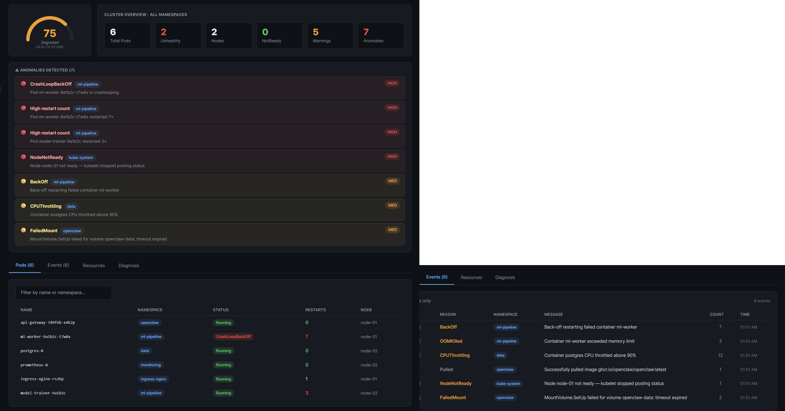

# Kubernetes Sentinel

An AI-powered Kubernetes cluster health dashboard that monitors all namespaces in real time, detects anomalies automatically, and uses Claude AI to generate plain-English root-cause diagnoses with ready-to-run kubectl remediation commands.

| Python | FastAPI | React | Kubernetes | License |
|--------|---------|-------|------------|---------|
| 3.12+ | 0.115 | 18 | 1.29+ | MIT |

---

## Dashboard Preview



The dashboard runs in your browser and connects to the FastAPI backend running locally or inside your cluster.

---

## Features

- **Live pod status** across all namespaces including phase, restart count, node, CPU and memory
- **Event stream** showing all Kubernetes events color-coded by severity with namespace context
- **Resource inventory** covering nodes, deployments, services, PVCs, configmaps and secrets
- **7 anomaly detection rules** for CrashLoopBackOff, OOMKilled, FailedMount, BackOff, NodeNotReady, CPUThrottling and high restart count
- **AI diagnosis** that sends the full cluster state to Claude and returns a plain-English root cause with 3 copy-paste kubectl remediation commands
- **Health score** showing a 0 to 100 composite score updated every 15 seconds
- **SSE live updates** so the browser receives push updates without polling
- **Historical timeline** showing a 24-hour health score graph with trend analysis
- **Mock mode** that works without a real cluster for development and demos using DEV_MODE=true

---

## Architecture

```
+--------------------------------------------------+
|              Kubernetes Cluster                  |
|                                                  |
|  +----------------------+  +-----------------+   |
|  |   sentinel pod       |  | All namespaces  |   |
|  |  FastAPI + poller    |  | pods / events / |   |
|  |  Python 3.12         |  | deployments     |   |
|  +----------+-----------+  +-----------------+   |
+-------------+------------------------------------+
              |  HTTP + SSE
              v
   +------------------+        +------------------+
   |  React Frontend  | -----> |   Claude API     |
   |  sentinel.jsx    | <----- |   AI diagnosis   |
   +------------------+        +------------------+
```

---

## Project Structure

```
k8s-sentinel/
├── .env.example              copy to .env and fill in your keys
├── .gitignore                .env and .venv are excluded
├── README.md
├── CHANGELOG.md
├── docs/
│   └── screenshots/
│       └── dashboard.png     dashboard preview image
│
├── backend/
│   ├── main.py               FastAPI entry point and lifespan hooks
│   ├── requirements.txt      pinned Python dependencies
│   ├── Dockerfile            multi-stage build running as non-root user
│   ├── core/
│   │   ├── k8s_client.py     auto-detects in-cluster vs kubeconfig auth
│   │   ├── poller.py         background thread with 15s polling loop
│   │   ├── anomaly.py        7-rule detection engine
│   │   └── database.py       SQLite storage for health timeline
│   ├── models/
│   │   └── schemas.py        Pydantic v2 data models
│   └── routers/
│       ├── pods.py           GET /api/pods
│       ├── events.py         GET /api/events and SSE stream
│       ├── resources.py      GET /api/resources
│       ├── timeline.py       GET /api/timeline
│       └── diagnosis.py      POST /api/diagnose
│
├── frontend/
│   └── sentinel.jsx          React dashboard as a single file
│
├── k8s/
│   ├── namespace.yaml        k8s-sentinel namespace
│   ├── rbac.yaml             ClusterRole read-only across all namespaces
│   ├── deployment.yaml       pod spec with liveness and readiness probes
│   ├── service.yaml          ClusterIP on port 8000
│   └── configmap.yaml        app configuration
│
└── scripts/
    ├── dev.ps1               run locally on Windows PowerShell
    ├── deploy.ps1            kubectl apply all manifests
    └── port-forward.ps1      forward service to localhost:8000
```

---

## Prerequisites

| Tool | Version | Purpose |
|------|---------|---------|
| Python | 3.12+ | Backend runtime |
| kubectl | 1.29+ | Cluster access for k8s deploy |
| Docker Desktop | 24+ | Build image and run kind |
| Kubernetes cluster | any | AKS, EKS, GKE, k3s or kind |
| Anthropic API key | any | AI diagnosis feature |

---

## Option A: Run Locally Without a Cluster

This mode uses mock data so you can see the full dashboard without any Kubernetes cluster. The entire setup takes under five minutes.

### 1. Clone the repo

```bash
git clone https://github.com/OsamaOracle/k8s-sentinel.git
cd k8s-sentinel
```

### 2. Configure environment

```powershell
# Windows
copy .env.example .env
```

```bash
# macOS and Linux
cp .env.example .env
```

Open `.env` and fill in:

```env
ANTHROPIC_API_KEY=sk-ant-your-key-here
DEV_MODE=true
POLL_INTERVAL_SECONDS=15
HOST=0.0.0.0
PORT=8000
```

Never commit `.env` to version control. It is gitignored and only `.env.example` belongs in the repo.

### 3. Create virtual environment and install dependencies

```powershell
cd backend

python -m venv .venv

# Activate on Windows
.venv\Scripts\Activate.ps1

# Activate on macOS and Linux
# source .venv/bin/activate

pip install -r requirements.txt
```

### 4. Start the backend

```powershell
$env:ANTHROPIC_API_KEY = "sk-ant-your-key-here"
$env:DEV_MODE = "true"
uvicorn main:app --reload --port 8000
```

You should see:

```
INFO:     Application startup complete.
INFO:     Uvicorn running on http://127.0.0.1:8000
```

### 5. Verify the API

Open a second terminal and run:

```powershell
curl http://localhost:8000/healthz
curl http://localhost:8000/api/pods
curl http://localhost:8000/api/events
curl http://localhost:8000/api/timeline
```

### 6. Open the dashboard

Open `frontend/sentinel.jsx`, copy the entire file contents, and paste it into a Claude.ai chat with the message: Render this React component as an artifact

The dashboard will render and connect to your backend at http://localhost:8000.

---

## Option B: Run with a Real Kubernetes Cluster

### 1. Set up a local cluster with kind

If you do not have a cloud cluster, spin one up locally using kind:

```powershell
winget install Kubernetes.kind
kind create cluster --name sentinel-dev
kubectl cluster-info --context kind-sentinel-dev
kubectl get nodes
```

### 2. Configure environment

```powershell
copy .env.example .env
```

Open `.env` and set:

```env
ANTHROPIC_API_KEY=sk-ant-your-key-here
DEV_MODE=false
KUBECONFIG_PATH=
POLL_INTERVAL_SECONDS=15
HOST=0.0.0.0
PORT=8000
```

Leave KUBECONFIG_PATH blank to use the default at ~/.kube/config.

### 3. Start the backend

```powershell
cd backend
python -m venv .venv
.venv\Scripts\Activate.ps1
pip install -r requirements.txt

$env:ANTHROPIC_API_KEY = "sk-ant-your-key-here"
$env:DEV_MODE = "false"
uvicorn main:app --reload --port 8000
```

The backend will start polling your real cluster every 15 seconds and return live data.

---

## Option C: Deploy to Kubernetes

This option runs the sentinel as a pod inside your cluster.

### 1. Build and push the Docker image

```bash
docker build -t your-registry/k8s-sentinel:latest ./backend
docker push your-registry/k8s-sentinel:latest
```

Update the image name in `k8s/deployment.yaml` to match your registry.

### 2. Create the API key secret

```bash
kubectl create secret generic sentinel-secrets \
  --from-literal=ANTHROPIC_API_KEY=sk-ant-your-key-here \
  -n k8s-sentinel
```

Never store secrets in files. Always create them directly with kubectl.

### 3. Apply all manifests

```powershell
# Windows
.\scripts\deploy.ps1
```

```bash
# macOS and Linux
kubectl apply -f k8s/namespace.yaml
kubectl apply -f k8s/rbac.yaml
kubectl apply -f k8s/configmap.yaml
kubectl apply -f k8s/deployment.yaml
kubectl apply -f k8s/service.yaml
```

### 4. Verify the deployment

```bash
kubectl get pods -n k8s-sentinel
kubectl logs -n k8s-sentinel -l app=k8s-sentinel -f
```

You should see Application startup complete in the logs.

### 5. Access the dashboard

```powershell
# Windows
.\scripts\port-forward.ps1
```

```bash
# macOS and Linux
kubectl port-forward svc/k8s-sentinel 8000:8000 -n k8s-sentinel
```

Then open http://localhost:8000 in your browser or load `frontend/sentinel.jsx` as a Claude.ai artifact.

---

## API Reference

| Method | Endpoint | Description |
|--------|----------|-------------|
| GET | /healthz | Liveness and readiness probe |
| GET | /api/pods | All pods across all namespaces |
| GET | /api/events | All events with optional filters |
| GET | /api/events/stream | SSE live event stream |
| GET | /api/resources | Nodes and deployments |
| GET | /api/timeline | 24-hour health score history |
| POST | /api/diagnose | AI diagnosis via Claude |

### Example diagnosis response

```json
{
  "summary": "The ml-worker pod in ml-pipeline is crashlooping due to a memory limit that is too low for the current workload.",
  "rootCause": "The container memory limit of 2Gi is being exceeded during model initialization. The process is killed before it can complete startup.",
  "kubectlCommands": [
    "kubectl logs ml-worker-6f4d8c9b5-tn8wq -n ml-pipeline --previous --tail=100",
    "kubectl set resources deployment ml-worker -n ml-pipeline --limits=memory=4Gi",
    "kubectl rollout status deployment/ml-worker -n ml-pipeline --timeout=120s"
  ]
}
```

---

## Environment Variables

| Variable | Default | Description |
|----------|---------|-------------|
| ANTHROPIC_API_KEY | required | Your Anthropic API key |
| DEV_MODE | false | Set to true to use mock data and skip cluster connection |
| KUBECONFIG_PATH | ~/.kube/config | Path to kubeconfig file, leave blank for in-cluster |
| POLL_INTERVAL_SECONDS | 15 | How often to poll the Kubernetes API in seconds |
| HOST | 0.0.0.0 | Server bind address |
| PORT | 8000 | Server port |

---

## Anomaly Detection Rules

| Rule | Severity | Trigger |
|------|----------|---------|
| CrashLoopBackOff | High | Pod phase is CrashLoopBackOff |
| OOMKilled | High | Event reason is OOMKilled |
| NodeNotReady | High | Node ready status is false |
| HighRestartCount | High | Pod has restarted 3 or more times |
| BackOff | Medium | Event reason is BackOff |
| FailedMount | Medium | Event reason is FailedMount |
| CPUThrottling | Medium | Event reason is CPUThrottling |

---

## Security

- No secrets in code. All credentials are loaded from environment variables or Kubernetes Secrets.
- Read-only RBAC. The ClusterRole only grants get, list and watch. The sentinel can never modify cluster resources.
- Non-root container. The Docker image runs as the sentinel user with UID 1000 and never as root.
- No data persistence. Cluster state is held in memory only and never written to an external database.
- The .env file is gitignored and your secrets are never committed.

---

## Troubleshooting

**ModuleNotFoundError: No module named core**

Make sure you are running uvicorn from inside the backend folder:

```powershell
cd backend
uvicorn main:app --reload --port 8000
```

**ConfigException: Invalid kube-config file**

Check that kubectl is configured and pointing at a live cluster:

```powershell
kubectl cluster-info
```

Or switch to mock mode:

```powershell
$env:DEV_MODE = "true"
```

**venv activation fails**

```powershell
python -m venv .venv
Set-ExecutionPolicy -Scope CurrentUser -ExecutionPolicy RemoteSigned
.venv\Scripts\Activate.ps1
```

**Dashboard shows Backend unreachable**

Confirm the backend is running with `curl http://localhost:8000/healthz` and check that BASE_URL in `sentinel.jsx` matches your backend port. The dashboard falls back to mock data automatically when the backend is unreachable.

---

## Contributing

1. Fork the repo
2. Create a feature branch with `git checkout -b feature/your-feature`
3. Copy `.env.example` to `.env` and fill in your keys
4. Make your changes
5. Open a pull request

Do not commit `.env`, real API keys or kubeconfig files.

---

## License

MIT. See LICENSE for details.